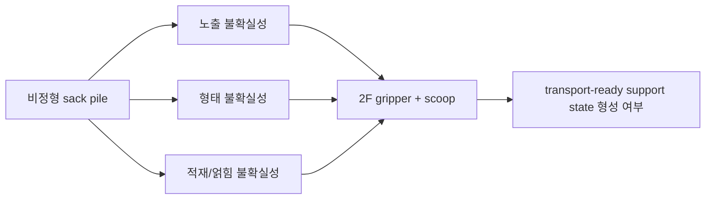
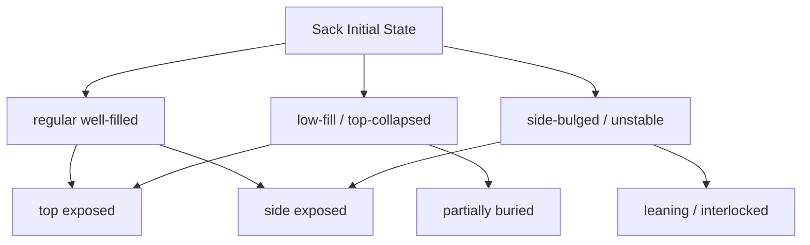
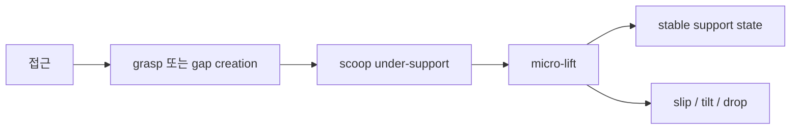

# 비정형 Sack Pile 연구 포지셔닝 메모

## 1. 지금 시뮬레이터로 주장할 수 있는 것

- grasp point가 불명확한 비정형 sack pile에서
- 2F gripper와 scoop 조합이
- `transport-ready support state`를 만들 수 있는지
- 형태 불확실성과 적재상태 다양성 하에서 비교 평가할 수 있다

즉, 현재 시뮬레이터의 가장 자연스러운 주장 범위는 아래입니다.

- `고정밀 자루 재질 시뮬레이터`가 아니라
- `형태/노출/얽힘 난이도를 포함한 task-driven manipulation benchmark`

## 2. 지금 시뮬레이터로 주장하면 위험한 것

- 실제 포장지의 기공 특성까지 반영했다
- 자루 간 섬유 마찰과 얽힘이 정량적으로 정확하다
- 실제 sack material deformation을 충실하게 재현한다
- 충돌 시 국소 주름/접힘/눌림이 실제와 동등하다

이 부분은 reviewer나 지도교수가 바로 질문할 가능성이 큽니다.

## 3. 추천 주장 방식

논문/발표에서는 아래처럼 표현하는 것이 안전합니다.

- 본 환경은 `high-fidelity digital twin`이 아니라 `research-oriented morphological benchmark`이다.
- 핵심 목표는 재질의 완전한 복원이 아니라 `support-state formation under shape and pile uncertainty`의 가능성 검증이다.
- 실제 sack의 모든 연속체 변형을 재현하지 못하므로, 물성 정합성보다는 `형태 다양성`, `노출 조건`, `지지 형성 난이도`, `실패 모드`를 중점적으로 모델링한다.

## 4. 추천 도식

### 4.1 연구 질문 도식

### 4.2 자루 상태 taxonomy 도식

### 4.3 support-state 형성 도식

## 5. 추천 실험 구조

### 5.1 시뮬레이터 실험

- 축 1: sack family
  - regular well-filled
  - low-fill / top-collapsed
  - side-bulged / unstable
- 축 2: pile difficulty
  - top exposed
  - side exposed
  - partially buried
  - leaning/interlocked
- 축 3: baseline
  - top grasp + flat scoop insertion + drag
  - fixed 2F+scoop pose
  - scoop-first gap creation + regrasp

측정값:

- support-state success
- insertion depth
- micro-lift stability
- slip / tilt / drop
- failure tags

### 5.2 실제 실험

가능하면 반드시 작은 scale의 실제 실험을 같이 붙이는 것이 좋습니다.

- 자루 3종 준비
  - 잘 채워진 자루
  - 상단이 무너진 저충전 자루
  - 한쪽이 불룩한 불안정 자루
- pile 10~20개 scene 수작업 구성
- baseline 행동을 사람이 재현하거나 원격 조작으로 재현
- 성공/실패와 failure mode만이라도 수집

이렇게 하면 시뮬레이터가 완벽하지 않아도 아래 주장이 가능합니다.

- 시뮬레이터 failure mode와 실제 failure mode가 어느 정도 대응한다
- 특정 baseline의 상대적 경향성이 실제와 유사하다

## 6. 추천 그림/표 구성

### Figure 1

- 실제 자루 사진
- 시뮬레이터 자루
- deformable preview 자루
- 각자의 주장 범위 비교

### Figure 2

- morphology taxonomy
- top-exposed / side-exposed / buried / leaning / interlocked 예시

### Figure 3

- baseline 3개 행동 순서 그림
- grasp, scoop insertion, micro-lift, support-state

### Table 1

- 시뮬레이터 fidelity 범위

예시 열:

- geometry diversity
- local compliance
- entanglement realism
- computation cost
- suitability for heuristic benchmark

### Table 2

- baseline별 success / insertion depth / failure tag 비율

## 7. 추천 서술 전략

가장 설득력 있는 방향은 아래입니다.

1. `정확한 sack material simulator`를 만들었다고 주장하지 않는다.
2. 대신 `비정형 sack support-state benchmark`를 만들었다고 주장한다.
3. 형태 다양성과 적재상태 불확실성을 taxonomy로 정의한다.
4. 그 taxonomy 위에서 baseline을 비교한다.
5. 실제 소규모 실험으로 failure mode 대응성을 보여준다.

## 8. 다음 구현 우선순위

1. deformable preview를 더 안정화해서 `2~3개 sack settle 장면`을 납득 가능하게 만든다.
2. morphology taxonomy label을 scene generator에 명시적으로 넣는다.
3. baseline 결과를 taxonomy별로 나눠 집계한다.
4. 실제 자루 소규모 실험과 시뮬레이터 failure mode를 비교한다.

## 9. 결론

현재 상황에서 가장 좋은 전략은:

- 물리 fidelity를 과장하지 않고
- 형태/배치/적재상태 다양성 중심 benchmark로 포지셔닝하고
- 실제 소규모 검증과 도식화를 붙여서
- `support-state formation feasibility`를 설득하는 것입니다.
