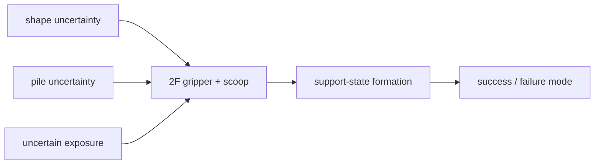
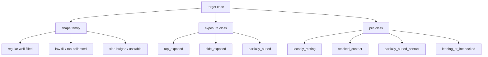
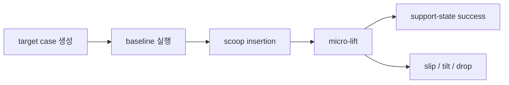

# Support-State Benchmark 포지셔닝 메모

## 1. 고정 연구 질문

이 저장소의 연구 질문은 아래로 고정합니다.

`support-state formation under shape and pile uncertainty`

즉, 핵심은:

- grasp point가 명확하지 않은 sack pile에서
- shape uncertainty와 pile uncertainty가 동시에 있을 때
- 2F gripper와 scoop 조합이
- `transport-ready support state`를 형성할 수 있는가

입니다.

## 2. 안전한 주장 범위

현재 구현은 아래처럼 설명하는 것이 안전합니다.

- `high-fidelity digital twin`이 아니라 `task-driven benchmark`
- 재질 fidelity 복원이 아니라 `uncertainty-aware manipulation benchmark`
- 물성 검증 환경이 아니라 `failure mode와 support-state 형성 가능성` 비교 환경

## 3. 피해야 할 표현

아래 표현은 피하는 것이 좋습니다.

- 정확한 sack material simulator
- 실제 포장지 재질을 충실히 재현한다
- 얽힘과 섬유 마찰을 정량적으로 복원한다
- 국소 주름/접힘/눌림이 실제와 동등하다

## 4. 권장 표현

- shape and pile uncertainty benchmark
- support-state benchmark
- target case taxonomy
- task-level evaluation
- heuristic baseline comparison
- failure mode analysis

## 5. 도식

### 5.1 연구 질문

```mermaid
flowchart LR
    A[shape uncertainty] --> D[2F gripper + scoop]
    B[pile uncertainty] --> D
    C[uncertain exposure] --> D
    D --> E[support-state formation]
    E --> F[success / failure mode]
```

### 5.2 target case taxonomy

```mermaid
flowchart TD
    A[target case] --> B[shape family]
    A --> C[exposure class]
    A --> D[pile class]
    B --> B1[regular well-filled]
    B --> B2[low-fill / top-collapsed]
    B --> B3[side-bulged / unstable]
    C --> C1[top_exposed]
    C --> C2[side_exposed]
    C --> C3[partially_buried]
    D --> D1[loosely_resting]
    D --> D2[stacked_contact]
    D --> D3[partially_buried_contact]
    D --> D4[leaning_or_interlocked]
```

### 5.3 평가 흐름

```mermaid
flowchart LR
    A[target case 생성] --> B[baseline 실행]
    B --> C[scoop insertion]
    C --> D[micro-lift]
    D --> E[support-state success]
    D --> F[slip / tilt / drop]
```

## 6. 권장 실험 구조

- 축 1: shape family
- 축 2: exposure class
- 축 3: pile class
- 축 4: baseline

측정값:

- support-state success
- scoop insertion depth
- micro-lift stability
- slip
- tilt
- drop
- failure tags

## 7. 논문/발표 서술 전략

1. 이 구현을 material simulator로 내세우지 않는다.
2. 대신 `support-state formation under shape and pile uncertainty`를 위한 benchmark로 제시한다.
3. taxonomy 위에서 baseline을 비교한다.
4. 성공률보다 failure mode 차이를 함께 해석한다.
5. 가능하면 소규모 실제 실험으로 failure mode 대응성을 보여준다.

## 8. 보조 reference preview의 위치

`preview_reference_case.py`는 benchmark 본체가 아닙니다.

- 정량 metric 산출용이 아님
- 물성 fidelity 주장용이 아님
- shell proxy 기반 접촉/settling을 정성적으로 보는 auxiliary reference

즉, 본 연구의 주장은 `run_baseline.py + evaluate_logs.py` 경로에서 만들어져야 합니다.
